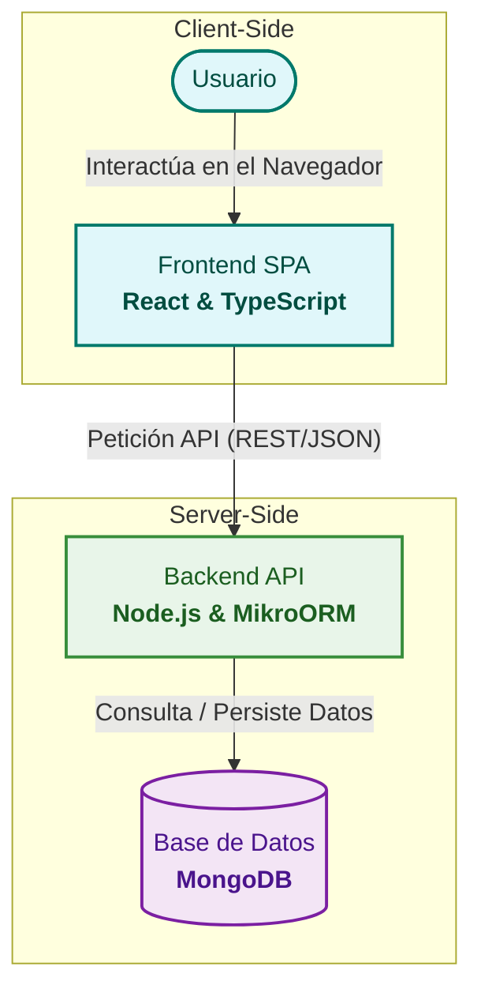

# 🏗️ Arquitectura de la Aplicación

### Modelo Multi-Repositorio

> El proyecto UpSkill está estructurado bajo un enfoque de **multi-repositorio**, donde el Frontend y el Backend se desarrollan y versionan de forma independiente. Esto facilita la especialización de los equipos y la autonomía en los despliegues.

| Repositorio            | Propósito                            | Enlace                                                             |
| :--------------------- | :----------------------------------- | :----------------------------------------------------------------- |
| **UpSkill - Frontend** | Aplicación de Cliente (SPA en React) | [Ver Repositorio](https://github.com/Frasquito3/Front-End-DSW.git) |
| **UpSkill - Backend**  | Servidor de API (Node.js)            | [Ver Repositorio](https://github.com/carlex74/Back-End-DSW.git)    |

### Diagrama de Flujo de Datos

> Esta arquitectura desacoplada permite que el Frontend pueda ser reemplazado o actualizado sin afectar al Backend, y viceversa, siempre que se respete el contrato de la API.

### Diagrama de Flujo de Datos

