```mermaid
graph TD;
    %% --- Definición de Estilos Visuales ---
    classDef client fill:#e0f7fa,stroke:#00796b,stroke-width:2px,color:#004d40;
    classDef server fill:#e8f5e9,stroke:#388e3c,stroke-width:2px,color:#1b5e20;
    classDef database fill:#f3e5f5,stroke:#7b1fa2,stroke-width:2px,color:#4a148c;

    %% --- Definición de Nodos ---
    User([ Usuario]);
    Frontend[" Frontend SPA<br><strong>React & TypeScript</strong>"];
    Backend[" Backend API<br><strong>Node.js & MikroORM</strong>"];
    Database[( Base de Datos<br><strong>MongoDB</strong>)];

    %% --- Agrupación Lógica en Subgrafos ---
    subgraph  Client-Side
        User
        Frontend
    end

    subgraph  Server-Side
        Backend
        Database
    end

    %% --- Definición de Conexiones y Flujo ---
    User -- "Interactúa en el Navegador" --> Frontend;
    Frontend -- "Petición API (REST/JSON)" --> Backend;
    Backend -- "Consulta / Persiste Datos" --> Database;

    %% --- Aplicación de Estilos a los Nodos ---
    class User,Frontend client;
    class Backend server;
    class Database database;
```

# 🏗️ Arquitectura de la Aplicación

### Modelo Multi-Repositorio

> El proyecto UpSkill está estructurado bajo un enfoque de **multi-repositorio**, donde el Frontend y el Backend se desarrollan y versionan de forma independiente. Esto facilita la especialización de los equipos y la autonomía en los despliegues.

| Repositorio            | Propósito                            | Enlace                                                             |
| :--------------------- | :----------------------------------- | :----------------------------------------------------------------- |
| **UpSkill - Frontend** | Aplicación de Cliente (SPA en React) | [Ver Repositorio](https://github.com/Frasquito3/Front-End-DSW.git) |
| **UpSkill - Backend**  | Servidor de API (Node.js)            | [Ver Repositorio](https://github.com/carlex74/Back-End-DSW.git)    |

### Diagrama de Flujo de Datos

> Esta arquitectura desacoplada permite que el Frontend pueda ser reemplazado o actualizado sin afectar al Backend, y viceversa, siempre que se respete el contrato de la API.

### Diagrama de Flujo de Datos

