# 🏗️ Arquitectura de la Aplicación

La arquitectura de **UpSkill** se fundamenta en un principio clave: el **desacoplamiento total entre el Frontend y el Backend**. Esta decisión estratégica nos permite desarrollar, probar y desplegar cada componente de forma independiente, garantizando la escalabilidad y facilitando el mantenimiento a largo plazo.

> El sistema está diseñado como una Aplicación de Página Única (SPA) que consume una API RESTful. Esta separación de responsabilidades es el pilar de nuestra estructura técnica.

---

## 📂 Estructura Multi-Repositorio

Para materializar el principio de desacoplamiento, hemos adoptado un enfoque de **multi-repositorio**. Cada componente principal del proyecto vive en su propio espacio, lo que facilita la gestión del código fuente, los permisos y los flujos de trabajo de CI/CD específicos para cada uno.

| Repositorio                    | Propósito                                                         |                               Enlace                               |
| :----------------------------- | :---------------------------------------------------------------- | :----------------------------------------------------------------: |
| 🖥️ **UpSkill - Frontend**      | Aplicación de Cliente (SPA) desarrollada en React y TypeScript.   | [Ir al Repositorio](https://github.com/upskill-team/Front-End-DSW) |
| ⚙️ **UpSkill - Backend**       | Servidor de API RESTful construido con Node.js y MikroORM.        | [Ir al Repositorio](https://github.com/upskill-team/Back-End-DSW)  |
| 📚 **UpSkill - Documentación** | Repositorio central para la documentación y gestión del proyecto. |                          **(Estás aquí)**                          |

---

## 🧬 Flujo de Datos y Componentes

El siguiente diagrama ilustra la interacción de alto nivel entre los componentes de la aplicación, desde la interacción del usuario en el navegador hasta la persistencia de los datos en la base de datos.

```mermaid
graph TD;
    %% --- Definición de Estilos Visuales ---
    classDef client fill:#e0f7fa,stroke:#00796b,stroke-width:2px,color:#004d40;
    classDef server fill:#e8f5e9,stroke:#388e3c,stroke-width:2px,color:#1b5e20;
    classDef database fill:#f3e5f5,stroke:#7b1fa2,stroke-width:2px,color:#4a148c;

    %% --- Definición de Nodos ---
    User([👤 Usuario]);
    Frontend["💻 Frontend SPA<br><strong>React & TypeScript</strong>"];
    Backend["☁️ Backend API<br><strong>Node.js & MikroORM</strong>"];
    Database[(🗃️ Base de Datos<br><strong>MongoDB</strong>)];

    %% --- Agrupación Lógica en Subgrafos ---
    subgraph Client-Side
        User
        Frontend
    end

    subgraph Server-Side
        Backend
        Database
    end

    %% --- Definición de Conexiones y Flujo ---
    User -- "Interactúa en el Navegador" --> Frontend;
    Frontend -- "Petición API (REST/JSON)" --> Backend;
    Backend -- "Consulta / Persiste Datos" --> Database;
    Database -- "Respuesta" --> Backend;
    Backend -- "Respuesta API (JSON)" --> Frontend;
    Frontend -- "Renderiza la UI" --> User;

    %% --- Aplicación de Estilos a los Nodos ---
    class User,Frontend client;
    class Backend server;
    class Database database;
```

---

| Tecnología                                                                                                                                     | Justificación Principal                                                                                                                                                                                                                                                                                                                                                                         |
| :--------------------------------------------------------------------------------------------------------------------------------------------- | :---------------------------------------------------------------------------------------------------------------------------------------------------------------------------------------------------------------------------------------------------------------------------------------------------------------------------------------------------------------------------------------------- |
| 
  
      | <ul><li><strong>Vasto Ecosistema y Comunidad:</strong> Acceso a un inmenso conjunto de librerías y herramientas probadas que aceleran el desarrollo.</li><li><strong>Modelo de Componentes Declarativo:</strong> Permite construir una interfaz modular, reutilizable y fácil de mantener.</li></ul>                                                                                            |
| 
  
            | <ul><li><strong>Arquitectura Robusta:</strong> Implementa los patrones <strong>Data Mapper</strong> y <strong>Unit of Work</strong>, resultando en un código más limpio y testeable.</li><li><strong>Integración Nativa con TypeScript:</strong> Ofrece un tipado fuerte de extremo a extremo.</li></ul>                                                                                        |
| 
  
 | <ul><li><strong>Modelo de Datos Flexible:</strong> Su esquema de documentos permite anidar datos complejos y evolucionar la aplicación sin migraciones rígidas.</li><li><strong>Eficiencia Operativa:</strong> El uso de servicios como MongoDB Atlas reduce la carga de administración de la base de datos. Atlas también cuenta con una versión gratuita y de fácil implementación.</li></ul> |
