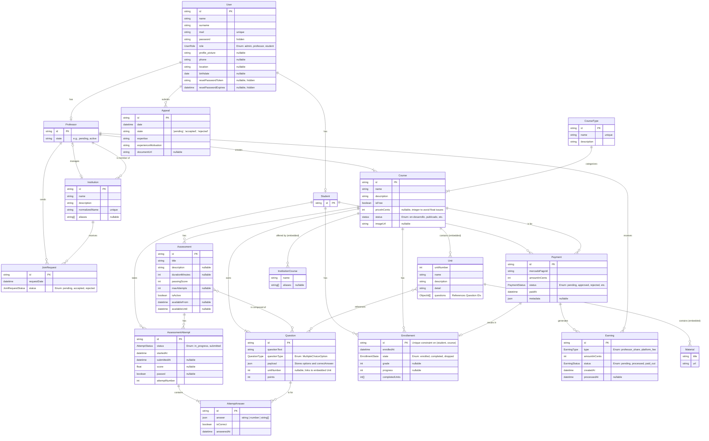

> **[Portal de Documentación](../README.md)** / 🏗️ Modelo de Datos

# 🏗️ Modelo de Datos

El modelo de datos de **UpSkill** es el pilar sobre el que se construye toda la lógica de negocio de la aplicación. Está diseñado para ser relacional, robusto y escalable, garantizando la integridad y consistencia de la información en todo el ecosistema.

Las entidades se organizan en cuatro dominios funcionales clave:

1.  **Usuarios y Perfiles:** Gestiona la identidad, roles (Estudiante, Profesor), autenticación y los perfiles específicos de cada tipo de usuario.
2.  **Contenido Pedagógico:** Define la estructura de los cursos, sus categorías y el banco de preguntas asociado a cada uno.
3.  **Sistema de Evaluaciones:** Modela las actividades, los intentos que realizan los estudiantes y el registro detallado de sus respuestas.
4.  **Flujo Financiero:** Administra todo el ciclo de transacciones, incluyendo pagos, matrículas y ganancias generadas.

---

## 🧬 Modelo de Datos (ERD)

El siguiente diagrama de Entidad-Relación (ERD) muestra el modelo de datos actual del sistema, incluyendo los atributos y las relaciones que existen entre las distintas entidades.

